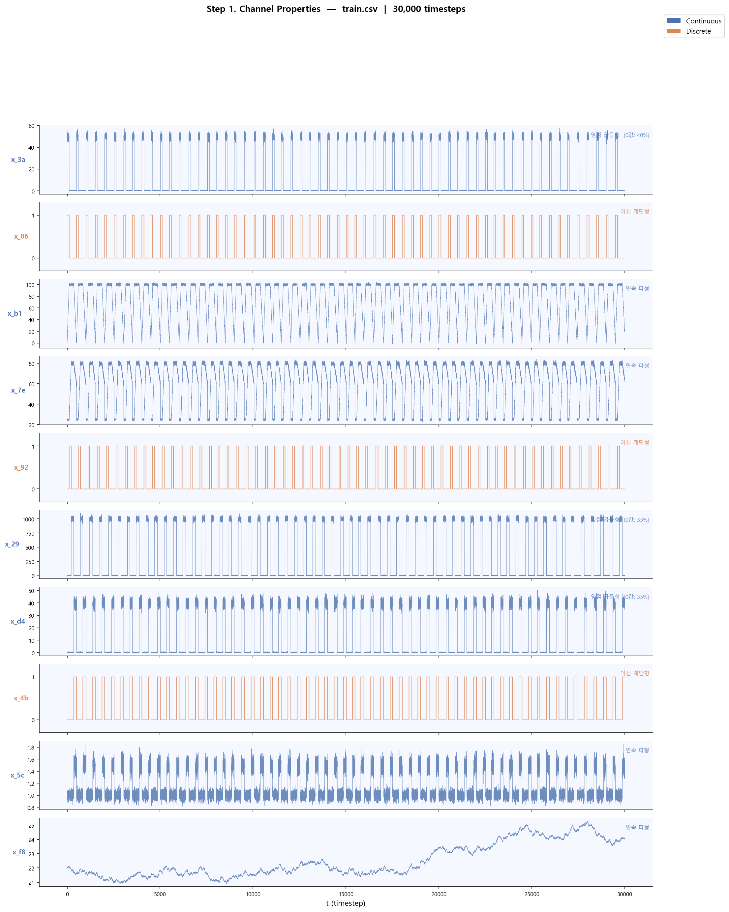
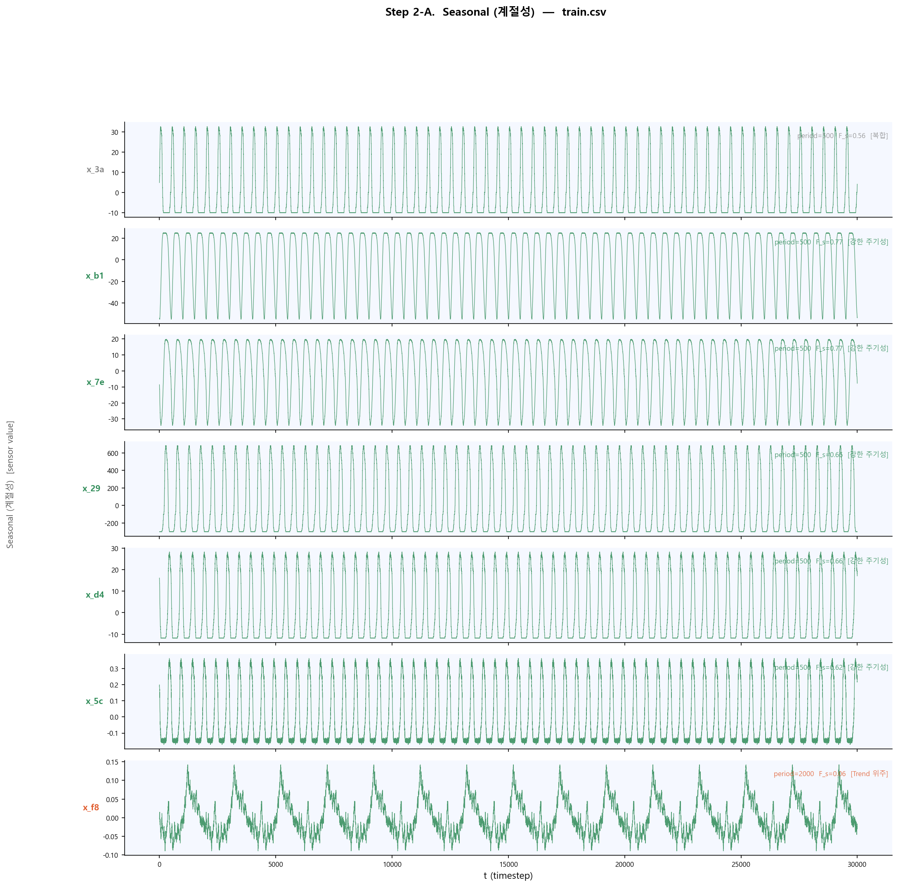
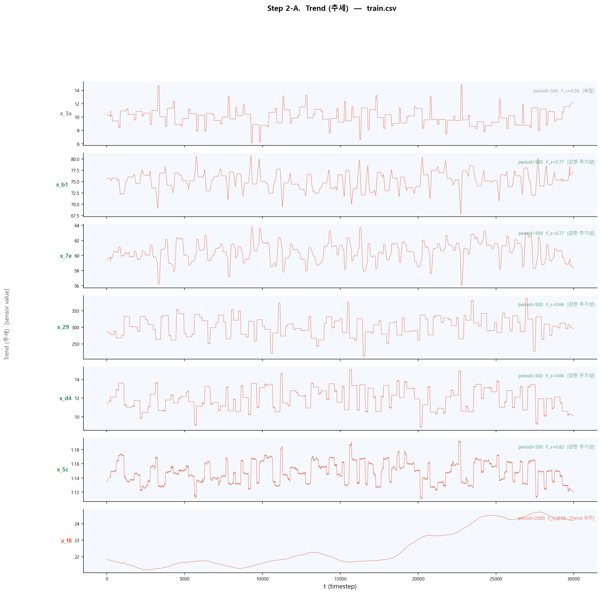
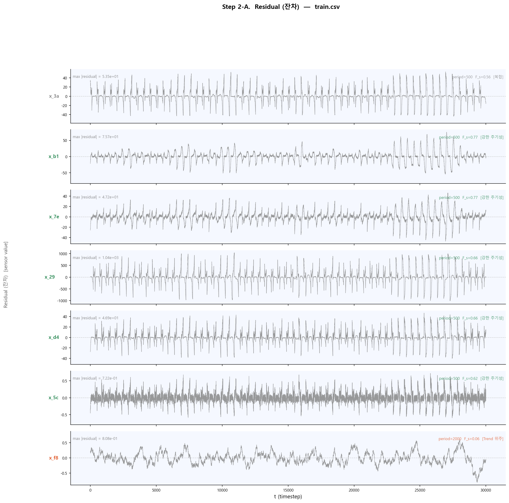
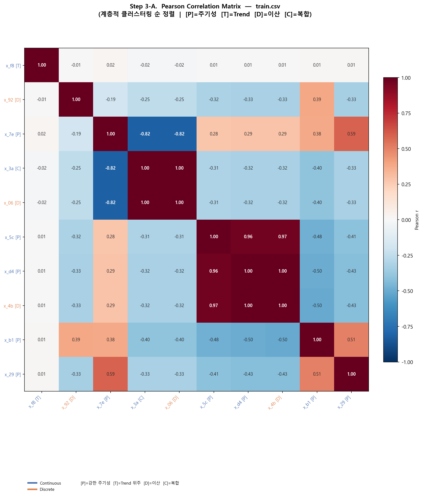
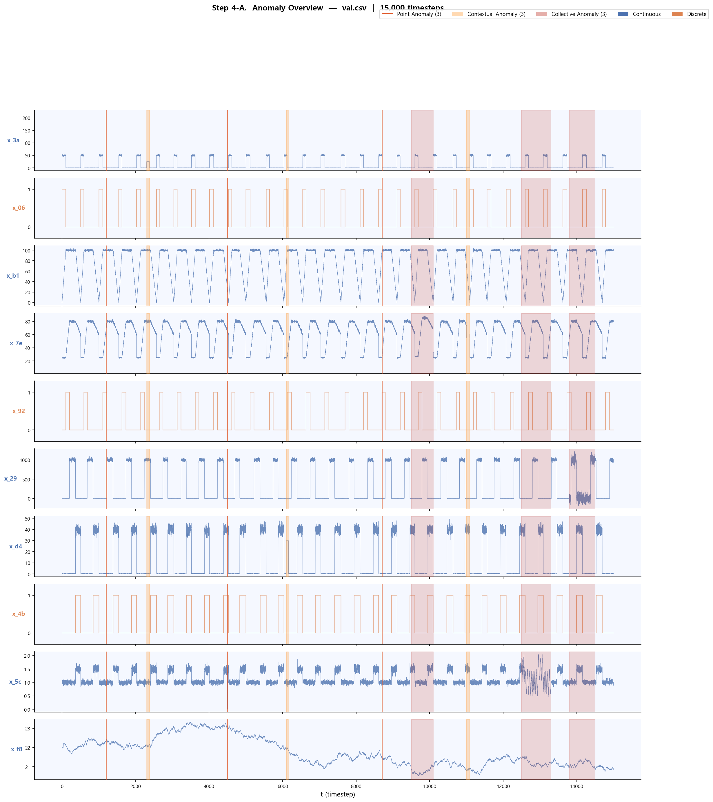

# 데이터 구성
- train.csv: 10개 채널이 모두 정상 데이터로 구성
- val.csv, test_public.csv: 정상과 이상 데이터가 섞여 있으며, 라벨이 포함 (정상: 0, 이상: 1)
- test_hidden_no_labels.csv: 라벨이 없는 최종 제출용 데이터

# 목표
다변량 시계열 데이터에서 이상탐지를 잘 수행하도록 모델을 학습시키고, validation/test set에서 AUROC, AUPR을 최대화하는 것

# EDA (Exploratory Data Analysis)
EDA를 통해 각 채널별 속성(연속형/이산형) 파악, 정상 데이터의 Seasonality/Trend 분석, 다변량 채널 간의 상관관계 분석, validation의 이상징후 유형 및 형태 파악 등을 수행하여 모델링에 필요한 인사이트를 얻는 단계

데이터를 분석하기 전에 결측치를 확인하고, 이를 처리한다. 

## Step 1. 채널별 속성 및 스케일 파악(연속형 vs 이산형 분류)
#### 분석 목적 
10개 채널의 데이터 분포와 기초 통계량을 분석하여 '연속형 센서 데이터'와 '이산형 상태 데이터'를 명확히 분류하고, 채널 간 스케일(값의 범위) 차이를 정량적으로 파악함.

#### 분석 결과
- `x_06`, `x_92`, `x_4b`: 이산형 채널 (값이 0과 1로만 구성, 각각 80.1%, 79.76%, 70.33%가 0)
- 나머지 7개 채널: 연속형 채널 (값이 다양한 범위를 가지며, 고유값도 많음)
- 채널 간 스케일 차이 존재 (예: `x_29`는 최대값이 1100 이상, `x_f8`는 최대값이 25 정도)

| channel | n_unique | zero_pct |    min    |     max     |    mean    |    std    |
|---------|----------|----------|-----------|-------------|------------|-----------|
| x_3a    | 17906    | 40.316667| 0.000000  | 57.400447   | 10.045609  | 19.935091 | 
| x_06    | 2        | 80.100000| 0.000000  | 1.000000    | 0.199000   | 0.399255  |
| x_b1    | 29978    | 0.076667 | -2.955392 | 103.787606  | 75.264274  | 32.188419 |
| x_7e    | 30000    | 0.000000 | 22.868571 | 83.933976   | 60.491569  | 21.643489 |
| x_92    | 2        | 79.756667| 0.000000  | 1.000000    | 0.202433   | 0.401820  |
| x_29    | 19563    | 34.793333| 0.000000  | 1100.041790 | 303.320547 | 458.431818|
| x_d4    | 19448    | 35.176667| 0.000000  | 50.210546   | 11.951830  | 18.269371 |
| x_4b    | 2        | 70.333333| 0.000000  | 1.000000    | 0.296667   | 0.456796  |
| x_5c    | 30000    | 0.000000 | 0.811008  | 1.851938    | 1.147833   | 0.236173  |
| x_f8    | 30000    | 0.000000 | 20.912449 | 25.283366   | 22.506816  | 1.185510  |

**인사이트 및 모델 연계**
1) [전처리 계획] 변수 간 스케일 차이가 거리 기반 모델(K-Means, OC-SVM)의 거리 및 밀도 연산 결과를 지배하는 현상을 방지하기 위해, 분포의 극단성을 보존하면서 표준화하는 StandardScaler 적용 필연성 도출.

2) [모델 구성 계획] (특징 선택 및 모델 매칭 전략)
    - 전략 A (전체 feature 보존): 10개 채널 전체를 원본 그대로 보존하여, 연속형과 이산형 간의 동기화된 다변량 결합 패턴과 고차원 격리에 강한 트리 기반 모델(Isolation Forest)의 입력으로 주입함.

    - 전략 B (연속형 중심 정제): 이산형 피처를 거리 공간 계산의 노이즈(방해 요인)로 간주하고 필터링하여, 연속형 센서 변수의 순수한 확률 분포 밀도 및 초평면 경계 학습에 집중하는 GMM 및 One-Class SVM 모델에 투입함.

## Step 2. 정상 데이터의 Seasonality/Trend 분석
#### 분석 목적
학습 데이터(train.csv)는 정상 데이터만으로 구성되어 있다. 이 데이터들을 대상으로 각 채널의 시계열 특성을 분석하여, 정상 상태가 어떤 패턴으로 움직이는지 파악하고 이후 전처리 및 모델 파라미터 설정의 근거를 마련한다.

시계열 분해 채널별로 데이터를 분해하여 Trend, Seasonality, Residual로 나누어 분석한다. 이를 통해 각 채널이 주기적인 패턴을 보이는지, 장기적인 추세가 존재하는지, 그리고 패턴과 추세를 제거한 후에도 남는 불규칙한 변동이 있는지를 파악한다.

자기 상관(ACF)와 부분 자기 상관(PACF) 분석을 통해 각 채널이 몇 시점 간격으로 반복되는지 파악한다.
이 주기 정보는 Sliding Window의 Window Size를 결정하는 데 참고할 수 있다.
예를 들어 ACF분석에서 500 시점 주기가 강하게 나타난다면, 모델이 정상 1 사이클을 온전히 학습할 수 있도록 Window Size를 500으로 설정하는 것을 고려할 수 있다.

#### 분석 결과
- 강한 Seasonality 채널: `x_3a`, `x_b1`, `x_7e`, `x_29`, `x_d4`, `x_5`, `x_f8` (연속형 채널 전체)   
- 계절성과 추세가 함께 존재하는 채널: `x_f8`
 

    <figure style="margin: 0; text-align: center;">
        
        <figcaption>Seasonality 분석</figcaption>
    </figure>
    <figure style="margin: 0; text-align: center;">
        
        <figcaption>Trend 분석</figcaption>
    </figure>
        <figure style="margin: 0; text-align: center;">
        
        <figcaption>Residual 분석</figcaption>
    </figure>

## Step 3. 다변량 채널 간의 상관관계 분석
#### 분석 목적
여러 채널이 서로 어떤 상관관계를 가지는지 파악한다. 채널 간 상관관계를 분석하여, 이상 탐지 시 단일 채널의 변화뿐 아니라 채널 간 관계의 변화도 이상 신호로 활용할 수 있다.

#### 분석 결과
- `x_3a`↔`x_06` : 높은 양의 상관관계 (0.999)   
- `x_d4`↔`x_4b` : 높은 양의 상관관계 (0.997)   
- `x_4b`↔`x_5c` : 높은 양의 상관관계 (0.966)   
- `x_d4`↔`x_5c` : 높은 양의 상관관계 (0.963)   

- `x_3a`↔`x_7e` : 높은 음의 상관관계 (-0.817)   
- `x_06`↔`x_7e` : 높은 음의 상관관계 (-0.817)   

## Step 4. validation의 이상징후 유형 및 형태 파악
- Point Anomaly: 단일 시점의값이 비정상
- Collective Anomaly: 개별 값은 정상이지만, 일정구간의 패턴이 비정상
- Contextual Anomaly:값 자체는 정상범위지만, 주어진 맥락에서 비정상 

#### 분석 목적
validation 데이터(val.csv)에 포함된 이상 데이터의 유형과 형태를 분석하여, 모델이 어떤 종류의 이상을 탐지해야 하는지 명확히 이해한다. 이를 통해 모델링 전략과 평가 기준을 구체화할 수 있다.

#### 분석 결과
| 타입	   | 구간	   |   길이   |
|---------|----------|----------|
|	Point |	t=1200, 4500, 8700 | 1~2 step
 |	Contextual | t=2300, 6100, 11000 |	60~90 step
|	Collective |	t=9500, 12500, 13800 |	600~800 step

# 전처리 계획
