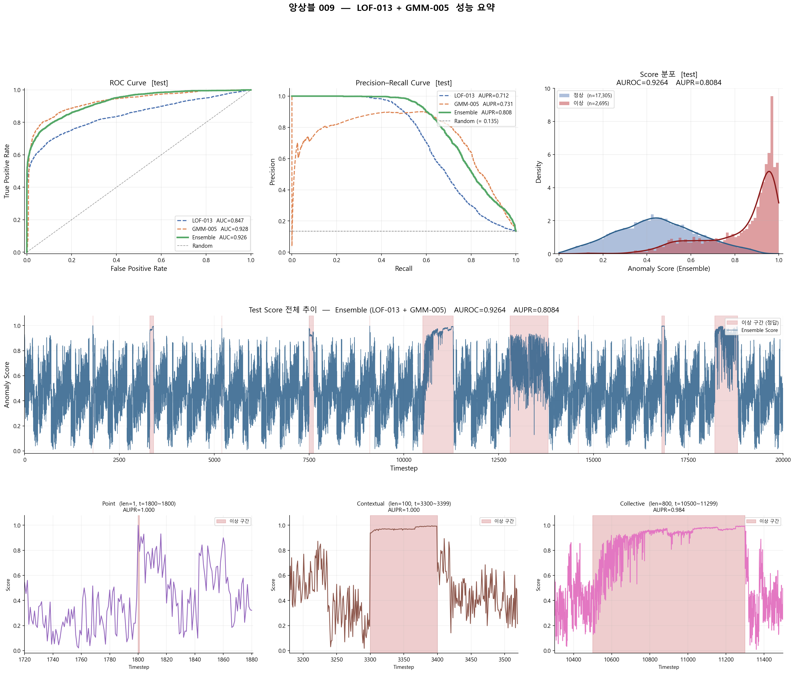

> 인천대학교 컴퓨터공학부 - 기계학습

# 다변량 시계열 이상치 탐지
자세한 내용은 [최종 보고서](최종보고서.pdf)을 참고 

## 개요

정상 데이터만으로 학습하여 이후 입력 데이터에서 이상치를 탐지하는 준지도 학습 기반 이상치 탐지 프로젝트입니다. Isolation Forest(IF), Local Outlier Factor(LOF), Gaussian Mixture Model(GMM) 세 모델을 단계적으로 개선하며 실험

## 데이터

- 10개 채널의 다변량 시계열 (이산형 3개: `x_06`, `x_92`, `x_4b` / 연속형 7개: `x_b1`, `x_29`, `x_7e`, `x_5c`, `x_f8`, `x_d4`, `x_3a`)
- train(라벨 없음) / val / test_public / test_private(라벨 없음)
- val 이상치 비율 약 15.6% → AUROC와 AUPR을 함께 평가 지표로 사용
- 이상 구간 유형: Point(1-5 step), Contextual(6-200 step), Collective(201 step 이상)

## 핵심 전처리

- **결측치**: 선형 보간 + 양 끝단 ffill/bfill
- **x_f8 차분**: `x_f8`이 train/val 간 distribution shift가 가장 심한 채널로 확인되어 1차 차분 적용
- **Rolling 통계**: 과거 누적 구간(min_periods=1)의 mean/std/min/max/range로 시계열 맥락 반영
- **이산형 채널**: IF는 rolling mean(활성화 비율)로 변환, LOF/GMM은 제외(거리·밀도 계산 왜곡 방지)
- **Scaler/PCA**: LOF/GMM에 StandardScaler 적용, GMM은 PCA(누적 분산 95%)로 차원 축소

## 실험 흐름 및 결과 (test_public)

### Isolation Forest

| | 구성 | AUPR | Point | Contextual | Collective |
|---|---|---|---|---|---|
| [IF-001](./experiments/isolation_forest/001_baseline.py) | raw 10채널 | 0.2198 | 0.0156 | 0.0477 | 0.1925 |
| [IF-002](./experiments/isolation_forest/014_ratio_rolling.py) | rolling 통계 + 이산형 비율 | 0.2511 | 0.0040 | 0.0516 | 0.2218 |
| [IF-003](./experiments/isolation_forest/013_diff_x_f8_ratio_rolling.py) | + x_f8 diff | 0.2705 | 0.0053 | 0.0485 | 0.2439 |

→ rolling/diff 모두 Collective 탐지에는 효과적이나, Point AUPR은 전 단계에서 거의 0. 단독 성능이 낮아 최종 앙상블에서 제외.

### Local Outlier Factor

| | 구성 | AUPR | Point | Contextual | Collective |
|---|---|---|---|---|---|
| [LOF-001](./experiments/lof/005_continous_scaler.py) | raw cont + Scaler | 0.5733 | 1.0000 | 0.6608 | 0.5047 |
| [LOF-002](./experiments/lof/009_continous_window_scaler.py) | + rolling 통계 (W=3) | 0.6395 | 0.3954 | 0.6763 | 0.5841 |
| **[LOF-003](./experiments/lof/012_diff_x_f8_continous_scaler.py)** | raw cont + x_f8 diff + Scaler | **0.7245** | **1.0000** | **0.9881** | 0.6742 |
| [LOF-004](./experiments/lof/014_diff_x_f8_cont_scaler_pca.py) | + PCA | 0.6619 | 1.0000 | 0.9739 | 0.6003 |

→ rolling은 오히려 Point 탐지력을 약화시킴. raw 값 유지 + x_f8 diff만 적용한 LOF-003이 최고 성능.

### Gaussian Mixture Model

| | 구성 | AUPR | Point | Contextual | Collective |
|---|---|---|---|---|---|
| [GMM-001](./experiments/gmm/002_rolling.py) | Scaler+PCA + rolling(5통계, W=20) | 0.7110 | 0.0207 | 0.5344 | 0.6566 |
| [GMM-002](./experiments/gmm/003_rolling_skew_kurt.py) | + skew/kurt | 0.6712 | 0.0718 | 0.5055 | 0.6314 |
| **[GMM-003](./experiments/gmm/005_diff_x_f8_rolling.py)** | GMM-001 + x_f8 diff | **0.7314** | 0.2320 | 0.5214 | **0.6864** |

→ skew/kurt는 가우시안 가정과 충돌하여 역효과. x_f8 diff 추가가 전반적 개선 + Point AUPR까지 향상.

## Window Size에 대한 결론

세 모델 모두 W≤50이 W≥200보다 일관되게 우수했음. window가 이상 구간(특히 Contextual, 최대 200 step)보다 크면 신호가 평균에 묻혀 희석되기 때문.

## 최종 모델 — LOF-Disc + GMM-003 앙상블

LOF-003에 이산형 3채널의 rolling mean(W=10)을 추가한 LOF-Disc를 구성(이산형 정보를 최종 모델에 반영하기 위함). LOF-Disc와 GMM-003의 score 간 상관계수가 낮아(ρ≈0.285) 앙상블 효과 기대.

| | AUROC | AUPR | Point | Contextual | Collective |
|---|---|---|---|---|---|
| [LOF-Disc](./experiments/lof/013_diff_x_f8_cont_disc_ratio.py) | 0.8471 | 0.7115 | 1.0000 | 0.9544 | 0.6589 |
| [GMM-003](./experiments/gmm/005_diff_x_f8_rolling.py) | 0.9283 | 0.7314 | 0.2320 | 0.5214 | 0.6864 |
| [Ensemble (최종)](./experiments/ensemble/009_lof013_gmm005.py) | **0.9264** | **0.8084** | **0.9667** | **0.9633** | **0.7716** |

이산형 정보를 포함하지 않은 [LOF-003+GMM-003](./experiments/ensemble/007_lof012_gmm005.py) 앙상블(AUPR 0.8149)보다 0.0065 낮지만, 10개 채널 전체를 활용한다는 점에서 LOF-Disc를 최종으로 채택.

앙상블 방식: 각 모델 score를 부호 반전(flip) → rank/N 정규화 → 단순 평균(0.5:0.5)



- ROC AUC: LOF-Disc 0.847, GMM-003 0.928, Ensemble 0.926    
- PR AUPR: LOF-Disc 0.712, GMM-003 0.731, Ensemble 0.808     
- Score 분포: 정상(n=17,305)은 0.3-0.6 부근에 넓게 분포, 이상(n=2,695)은 0.8-1.0에 집중되어 두 분포가 명확히 분리됨      

→ 앙상블이 두 단일 모델의 PR curve를 모두 상회하며, 특히 Recall 0.4-0.9 구간에서 가장 안정적인 하강 곡선을 형성

전체 score는 데이터의 주기성(`x_06` 등)에 따라 0~1 사이를 빠르게 진동하지만, 실제 이상 구간(빨간 음영)에서는 **진동이 멈추고 score가 0.9 이상에서 sustained**되는 패턴이 뚜렷하게 구분됨.

| 유형 | 길이 | 위치 | AUPR |
|------|------|------|------|
| Point | 1 step | t=1800 | 1.000 |
| Contextual | 100 step | t=3300~3399 | 1.000 |
| Collective | 800 step | t=10500~11299 | 0.984 |

세 유형 모두 이상 구간 진입과 동시에 score가 sustained 고점(≥0.9)으로 전환되며, 구간 종료와 함께 다시 진동 패턴으로 복귀함. 이는 정상 구간의 진동(노이즈)과 실제 이상치를 구분하는 핵심 시각적 근거임.

## 한계

- IF는 트리 기반 isolation 구조상 Point anomaly를 탐지하지 못함
- 이산형 채널은 raw 입력 / rolling 비율 / LOF concat 세 방식 모두 큰 개선을 보이지 못함
- rolling window 크기는 사전에 알려진 이상치 길이 정의에 의존하여 결정됨

## 실행 방법

```bash
python final_code.py
```

`data/train.csv`, `data/test_hidden_no_labels.csv`를 읽어 `test_hidden_no_labels_result.csv`(t, score)를 생성합니다.

## 폴더 구조

```
experiments/
  isolation_forest/    # IF 실험
  lof/                 # LOF 실험
  gmm/                 # GMM 실험
  ensemble/            # 앙상블 실험
src/                   # data_loader, preprocessing, features, models, evaluate, ensemble
202302904.py           # 최종 제출 코드
```
